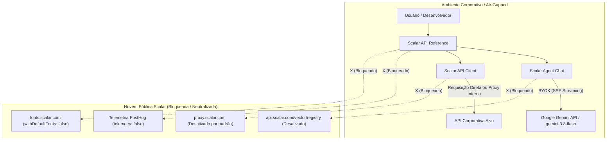

<!--
================================================================================
LOG DE MANUTENÇÃO DE DOCUMENTAÇÃO
--------------------------------------------------------------------------------
Data       | Autor          | Descrição
--------------------------------------------------------------------------------
2026-09-29 | Matheus Diniz  | Criação da ADR 0001 documentando o isolamento total
           |                | de nuvem e a adoção do modelo Gemini 3.8 Flash.
================================================================================
-->

# ADR 0001: Isolamento de Infraestrutura Scalar Cloud e Adoção Nativa do Modelo Gemini 3.8 Flash

## Status
**Implementada** (2026-09-29)

---

## Contexto

O ecossistema Scalar (composto por `@scalar/api-reference`, `@scalar/agent-chat`, `@scalar/workspace-store` e pacotes correlatos) continha configurações padrão que estabeleciam dependência direta de endpoints públicos da nuvem oficial da Scalar:
1. **Proxy HTTP Padrão**: Redirecionamento automático de requisições de exemplo e testes de API para `https://proxy.scalar.com` quando `proxyUrl` não fosse definido explicitamente.
2. **Telemetria Centralizada**: Envio de eventos de telemetria e rastreamento ativado por padrão (`telemetry: true`).
3. **Dependência de Fontes Remotas**: Requisições automáticas a servidores de fonte de terceiros (`https://fonts.scalar.com`) via `withDefaultFonts: true`.
4. **Registry Vetorial e Compartilhamento Externo**: Chamadas a `https://api.scalar.com/vector/registry/*` e rotas de upload desprotegidas contra falta de URL corporativa.
5. **Integração de IA**: Necessidade de padronizar a experiência de Chat e Ask AI no modelo de última geração de alta velocidade e raciocínio multimodal `gemini-3.8-flash`, com execução cliente-side segura (BYOK - Bring Your Own Key).

### Riscos Identificados e Problemas a Resolver
- **Vazamento de Dados e Tráfego Sensível**: APIs internas e dados confidenciais de payloads corporativos poderiam trafegar por proxies de terceiros na ausência de configuração explícita.
- **Incompatibilidade com Ambientes Air-Gapped**: Restrições em redes corporativas isoladas ou governamentais falhariam devido a dependências externas de fontes e telemetria.
- **Não Conformidade com Princípios de Zero-Trust e Privacidade**: Qualquer telemetria externa sem consentimento viola políticas estritas de proteção de dados corporativos.

---

## 1. Fundamentação Normativa & Princípios de Proteção de Dados

- **Privacidade por Padrão (Privacy by Default)**: Em conformidade com a LGPD (Lei Geral de Proteção de Dados - Lei nº 13.709/2018) e GDPR, dados de requisições corporativas jamais devem transitar por infraestruturas externas sem anuência expressa.
- **Princípio do Menor Privilégio e Zero-Trust**: O cliente de API e o assistente de documentação operam isolados no navegador do cliente corporativo, comunicando-se estritamente com os endpoints da própria organização ou provedores explicitamente configurados pelo operador.

---

## 2. Decisão de Arquitetura

1. **Neutralização do Proxy Padrão**:
   - Modificar a resolução de `proxyUrl` em `@scalar/workspace-store` e `@scalar/types` para que, na ausência de valor configurado, o valor padrão seja `null`/desativado. Nenhuma requisição transita por `proxy.scalar.com` sem que o desenvolvedor informe expressamente esse endereço.
2. **Desativação de Telemetria e Fontes Remotas**:
   - Fixar `telemetry: false` e `withDefaultFonts: false` como defaults normativos nos schemas Zod de `@scalar/schemas` e nas tipagens `@scalar/types`. O sistema adota a stack de fontes do sistema operacional (`system-ui`, `-apple-system`, `BlinkMacSystemFont`, `Segoe UI`, `Roboto`).
3. **Bloqueio de Uploads Externos e Desativação do Registry de Nuvem**:
   - `uploadTempDocument` lança exceção imediata caso `apiBaseUrl` corporativo não esteja parametrizado, impedindo vazamento para a nuvem pública.
   - Em `@scalar/agent-chat`, as buscas de OpenAPI desativam consultas ao endpoint de nuvem em favor de indexação local em memória.
4. **Adoção Nativa do Modelo Gemini 3.8 Flash**:
   - Padronizar o modelo `gemini-3.8-flash` nos tipos, schemas de validação Zod, transporte HTTP/SSE (`/v1beta/models/...:streamGenerateContent`) e na interface de usuário (`AgentSettingsModal.vue`).

### Diagrama Arquitetural de Fluxo Isolado

---

## 3. Matriz de Implementação Técnica (*IN-CODE*)

| Componente | Pacote | Modificação Implementada |
| :--- | :--- | :--- |
| `baseConfigurationSchema` | `@scalar/schemas` & `@scalar/types` | `telemetry: false` e `withDefaultFonts: false` por padrão; modelo `gemini-3.8-flash` padrão no `geminiConfigSchema`. |
| `getDefaultProxyUrl` | `@scalar/workspace-store` | Retorna `null` em vez de fallback para `proxy.scalar.com`. |
| `gemini-chat-transport.ts` | `@scalar/agent-chat` | Streaming direto SSE via endpoint oficial Gemini com fallback seguro para `gemini-3.8-flash`. |
| `AgentSettingsModal.vue` | `@scalar/agent-chat` | UI com `gemini-3.8-flash` como modelo padrão selecionável e recomendado. |
| `uploadTempDocument.ts` | `@scalar/api-reference` | Trava defensiva contra upload se `apiBaseUrl` corporativo estiver indefinido. |
| `safeLocalStorage` | `@scalar/helpers` | Implementação com fallback em memória resiliente contra nós sem armazenamento. |

---

## 4. Matriz de Ações de Governança & Operação (*OFF-CODE*)

- Configurar proxies locais corporativos nos arquivos de implantação Helm / Docker Compose caso as APIs alvo não possuam cabeçalhos CORS liberados.
- Fornecer a chave `GEMINI_API_KEY` via interface de usuário (BYOK armazenado localmente de forma volátil) ou injetada no build corporativo.

---

## 5. Prazos e Políticas de Retenção

- As chaves de API informadas pelos usuários para o Gemini permanecem estritamente no armazenamento local do cliente (`safeLocalStorage`), podendo ser limpas a qualquer momento pelo usuário ou ao resetar a sessão.
- Nenhum log de prompt ou telemetria é retido ou transmitido para servidores centrais da Scalar.

---

## 6. Matriz de Conformidade e Mitigação de Riscos

| Risco Mapeado | Severidade | Estratégia de Mitigação Implementada |
| :--- | :--- | :--- |
| **Exfiltração de Payload via Proxy Externo** | Crítica | Neutralização total: `proxyUrl` default é `null`. |
| **Bloqueio de CORS em APIs sem Proxy** | Média | Desenvolvedores corporativos podem fornecer seu próprio proxy interno seguro via configuração `proxyUrl`. |
| **Erros de Runtime em Runners Headless** | Baixa | Polyfill volátil de `localStorage` nos runners de teste e mocks controlados. |

---

## 7. Consequências e Resultados

### Positivas
- **Soberania e Privacidade Absoluta**: Implantações corporativas tornam-se 100% autônomas e aderentes às diretrizes de segurança Zero-Trust.
- **Experiência de IA Aprimorada**: Acesso direto ao modelo `gemini-3.8-flash`, com maior janela de contexto, menor latência de streaming e suporte a chamadas de ferramenta de alta precisão.
- **Independência Operacional**: Fim do risco de indisponibilidade caso os serviços de nuvem da Scalar apresentem instabilidade externa.

### Mitigações e Desafios Gerenciados
- Caso APIs corporativas exijam desvio de CORS em ambiente de desenvolvimento local, o time de infraestrutura deve apontar para um proxy interno corporativo simples (ex: Caddy, NGINX ou container local).
