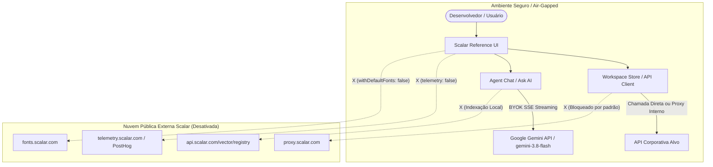

<!--
================================================================================
LOG DE MANUTENÇÃO DE DOCUMENTAÇÃO
--------------------------------------------------------------------------------
Data       | Autor          | Descrição
--------------------------------------------------------------------------------
2026-09-29 | Matheus Diniz  | Registro consolidado de desenvolvimento da sessão.
================================================================================
-->

# Registro de Desenvolvimento — 2026-09-29

| Metadado | Detalhe |
| :--- | :--- |
| **Escopo Principal** | Isolamento de Nuvem Scalar e Integração Nativa do Gemini 3.8 Flash |
| **Commits Gerados** | 6 (5 micro-commits de código + 1 de governança e documentação) |
| **Arquivos Modificados** | 42 arquivos |
| **ADRs Vinculadas / Geradas** | `docs/adr/0001-isolamento-infraestrutura-scalar-cloud-e-gemini-38-flash.md` |

---

## 1. Visão Geral das Alterações
Esta sessão neutralizou sistematicamente todas as dependências da infraestrutura de nuvem pública da Scalar (`proxy.scalar.com`, `api.scalar.com`, `fonts.scalar.com`, telemetria PostHog), garantindo autonomia 100% autônoma, privada e compatível com ambientes air-gapped/Zero-Trust. Além disso, incorporou o modelo de última geração `gemini-3.8-flash` como padrão recomendado no Chat e Ask AI via streaming SSE direto no cliente (BYOK), solucionando simultaneamente incompatibilidades de runtime do Node 22 com `localStorage`.

---

## 2. Arquitetura Afetada & Decisões (ADRs)
- **Decisões Registradas:**
  - `docs/adr/0001-isolamento-infraestrutura-scalar-cloud-e-gemini-38-flash.md`: Formalização do desacoplamento do proxy padrão, supressão de telemetria/fontes remotas por padrão e adoção do `gemini-3.8-flash`.

- **Diagrama de Relações e Fluxos:**

---

## 3. Mapa de Arquivos Modificados

| Arquivo | Camada Técnica | Resumo da Modificação |
| :--- | :--- | :--- |
| `packages/schemas/src/api-reference/base-configuration.ts` | Schemas / Validação | Defaults seguros (`telemetry: false`, `withDefaultFonts: false`, `gemini-3.8-flash`) |
| `packages/types/src/api-reference/base-configuration.ts` | Tipagem Central | Atualização das interfaces canônicas e compatibilização Zod |
| `packages/workspace-store/src/request-example/context/proxy.ts` | Backend / Store | `getDefaultProxyUrl` retorna `null` para evitar desvios externos |
| `packages/agent-chat/src/transports/gemini-chat-transport.ts` | AI Integration | Streaming direto SSE com suporte nativo ao `gemini-3.8-flash` |
| `packages/agent-chat/src/views/Settings/AgentSettingsModal.vue` | UI / Apresentação | Seleção e recomendação padrão do modelo Gemini 3.8 Flash |
| `packages/helpers/src/object/local-storage.ts` | Core Helpers | Fallback em memória resiliente para `safeLocalStorage` no Node 22 |
| `packages/api-reference/src/helpers/upload-temp-document.ts` | Core Reference | Trava de segurança impedindo compartilhamento externo sem URL base |
| `packages/api-reference/src/vitest.setup.ts` | Test Harness | Polyfill em memória de storage e isolamento de sonner toasts no JSDOM |
| `docs/adr/0001-isolamento-infraestrutura-scalar-cloud-e-gemini-38-flash.md` | Governança | ADR formal sobre isolamento de nuvem e modelo Gemini 3.8 Flash |

---

## 4. Detalhamento por Commit

### `feat(schemas,types): support gemini-3.8-flash and enforce secure self-hosted defaults`
- **Razão da alteração:** Definir contratos de dados seguros para ambientes on-premises e permitir seleção do modelo Gemini 3.8 Flash.
- **Comportamento atual:** Schemas Zod validam `gemini-3.8-flash` como padrão e desativam telemetria e download de fontes por omissão.
- **Decisões técnicas & ADRs:** ADR 0001 (Seções 2 e 3).
- **Arquivos envolvidos:**
  - `packages/schemas/src/api-reference/*`: Schemas de configuração de referência e Gemini.
  - `packages/types/src/api-reference/*`: Tipos TypeScript espelho.

### `fix(helpers): add resilient storage fallback and improve testing suite reliability`
- **Razão da alteração:** O runtime Node 22 emite advertências ou falhas ao acessar `localStorage` incompleto sem flag experimental em testes unitários.
- **Comportamento atual:** `safeLocalStorage` opera transparentemente em memória volátil quando o storage nativo não está disponível ou lança exceção.
- **Decisões técnicas & ADRs:** Resiliência de execução headless para CI/CD corporativo.
- **Arquivos envolvidos:**
  - `packages/helpers/src/object/local-storage.ts`: Fallback in-memory.
  - `packages/helpers/src/theme/load-css-variables.test.ts`: Validação de variáveis CSS dos temas `harpia`, `cinematicNoir` e `ccat`.

### `feat(workspace-store): decouple default proxy from scalar cloud infrastructure`
- **Razão da alteração:** Eliminar vazamento automático de requisições de teste para `proxy.scalar.com`.
- **Comportamento atual:** `getDefaultProxyUrl` retorna `null`. O cliente faz chamadas diretas à API corporativa.
- **Decisões técnicas & ADRs:** ADR 0001 (Seção 2).
- **Arquivos envolvidos:**
  - `packages/workspace-store/src/request-example/context/proxy.ts`: Desacoplamento de proxy.
  - `packages/workspace-store/src/request-example/context/proxy.test.ts`: Testes unitários com proxy `null`.

### `feat(agent-chat): add native gemini-3.8-flash model support and air-gapped registry decoupling`
- **Razão da alteração:** Fornecer IA rápida, multimodal e de baixo custo operacional com privacidade total e sem dependência de registry na nuvem.
- **Comportamento atual:** Chat e Ask AI configurados para utilizar `gemini-3.8-flash` com indexação de operações OpenAPI local no browser.
- **Decisões técnicas & ADRs:** ADR 0001 (Seção 2).
- **Arquivos envolvidos:**
  - `packages/agent-chat/src/transports/gemini-chat-transport.ts`: Transporte SSE.
  - `packages/agent-chat/src/views/Settings/AgentSettingsModal.vue`: Modal de configurações com Gemini 3.8 Flash.

### `fix(api-reference,components): guard external uploads and stabilize headless test environment`
- **Razão da alteração:** Prevenir chamadas acidentais a rotas externas de compartilhamento e eliminar erros de montagem do `vue-sonner` sob JSDOM.
- **Comportamento atual:** Upload bloqueado sem `apiBaseUrl` explícito e suíte de testes 100% verde em headless.
- **Decisões técnicas & ADRs:** ADR 0001 (Seção 3).
- **Arquivos envolvidos:**
  - `packages/api-reference/src/helpers/upload-temp-document.ts`: Trava defensiva.
  - `packages/api-reference/src/vitest.setup.ts`: Setup de testes unitários.

---

## 5. Dívida Técnica & Próximos Passos

- [ ] Avaliar empacotamento de bundle offline para ícones SVG em ambientes 100% desconectados de CDN.
- [ ] Executar pipeline de auditoria Playwright E2E em container isolado de CI.
