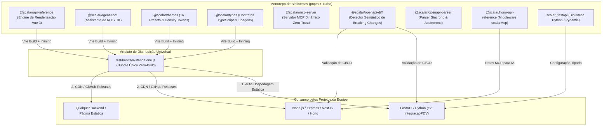
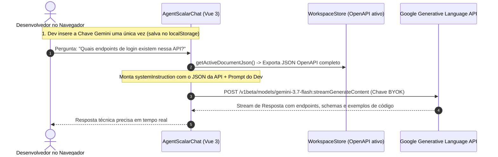
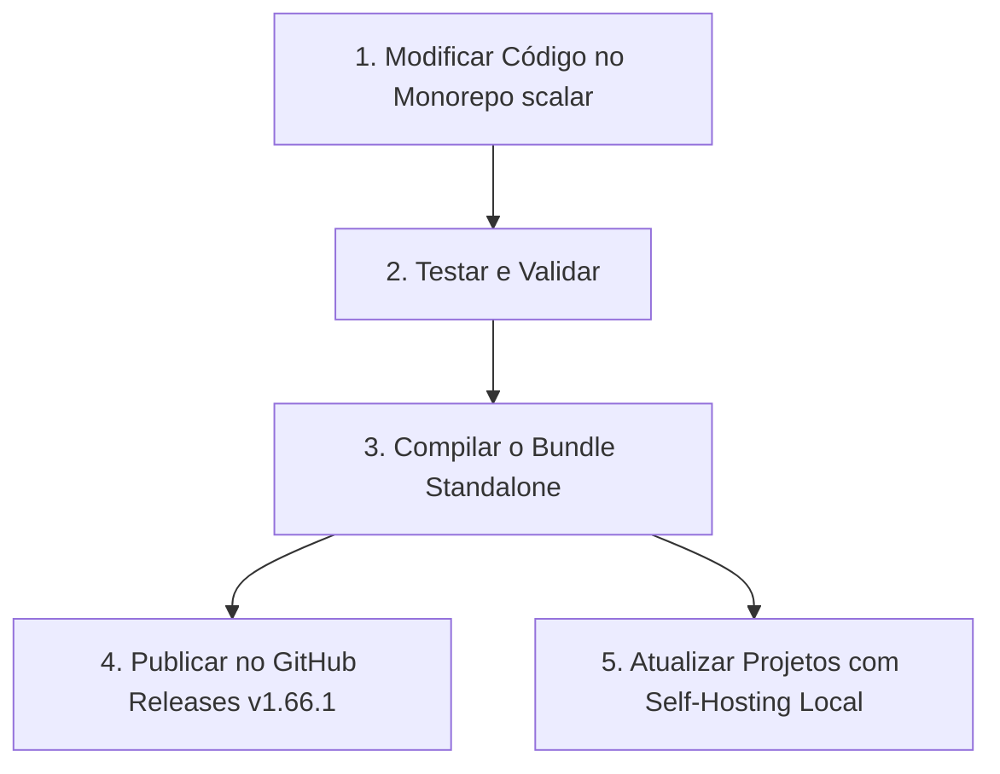
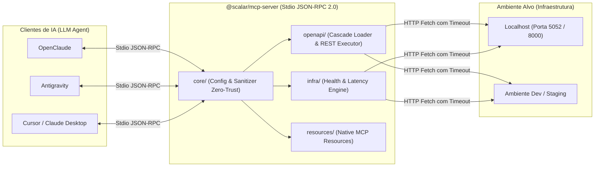

# 🏛️ Guia de Arquitetura, Melhorias e Manutenção do Fork Scalar

<!-- 
=================================================================================
DOCUMENTO DE ENGENHARIA E ARQUITETURA DE SOFTWARE
=================================================================================
Título:      Arquitetura, Melhorias e Guia de Manutenção do Fork Scalar
Autor:       Matheus Diniz (@mat-dgruber)
Versão:      1.0.0 (2026-08-24)
Repositório: https://github.com/mat-dgruber/scalar
=================================================================================
-->

> **Este documento detalha a arquitetura interna do fork customizado do Scalar (`@mat-dgruber/scalar`), suas melhorias em relação ao upstream oficial, como ele é consumido pelos projetos da equipe e o fluxo operacional de manutenção.**

---

## 🧭 1. O Scalar no nosso Fork é uma Biblioteca?

**Sim, e também muito mais do que isso.** O repositório é estruturado como um **Monorepo Multicamada** que atende a 3 propósitos complementares:



### As 3 Formas em que o Fork é Distribuído:

1. **Como Bundle Standalone Zero-Build (`standalone.js`):**
   - É o produto final gerado por `packages/api-reference`.
   - Empacota Vue 3, Tailwind CSS, parser OpenAPI, temas e o assistente de IA em um arquivo JS único.
   - Expõe a API global `window.Scalar = { createApiReference }`.
   - **Vantagem:** Quem desenvolve o backend (Python, Go, Java, PHP) **não precisa instalar Node.js, Vite ou Tailwind**. Basta incluir a tag `<script>`.

2. **Como Biblioteca Python (`scalar_fastapi`):**
   - Localizada em `integrations/fastapi/scalar_fastapi`.
   - Oferece a função `get_scalar_api_reference(...)`, Enums (`Theme`, `Layout`) e modelos Pydantic (`AgentScalarConfig`) para gerar o HTML de documentação de forma segura e tipada.

3. **Como Pacotes NPM Modulares (`@scalar/*`):**
   - Mais de 40 pacotes modulares TypeScript que podem ser importados individualmente em aplicações React, Vue, Svelte ou serviços Node.js.

---

## 🛠️ 2. Melhorias e Diferenciais do nosso Fork

O fork `@mat-dgruber/scalar` adiciona recursos fundamentais para ambientes corporativos e fluxos de alta produtividade:

| Funcionalidade | Upstream Oficial (`@scalar/scalar`) | Nosso Fork (`@mat-dgruber/scalar`) |
| :--- | :---: | :---: |
| **IA Assistant (Chat)** | Apenas backend proprietário pago da Scalar | **Google Gemini Nativo (BYOK)** + Model Selector |
| **Contexto OpenAPI na IA** | Servidor de embeddings da nuvem | **Injeção Dinâmica em Tempo Real** via `systemInstruction` |
| **Ask AI Agent por Rota** | Apenas abre o chat genérico sem contexto | **Injeção Automática de Metadados** `[Endpoint: METODO /path]` |
| **Menções no Chat (@ e /)** | Inexistente (digitação manual) | **Autocomplete de Endpoints** com badges de método e navegação por setas |
| **Botão MCP na UI** | Redirecionamento para cadastro em nuvem | **Ações Locais para OpenClaude & Antigravity** + Deep Links |
| **Servidor MCP Autônomo** | Registros e proxies em cloud externa | **@scalar/mcp-server Stdio & Dynamic Tools** (OpenClaude & Antigravity) |
| **Middleware MCP em Frameworks** | Inexistente | **scalarMcp** nativo para Hono e Express |
| **Análise Semântica de Diff** | Inexistente | **@scalar/openapi-diff** com recomendação SemVer para CI/CD |
| **Densidade de Layout** | Apenas espaçamento fixo | **Tokens de Densidade** (`.scalar-compact` para desenvolvedores pro) |
| **Parsing Não-Bloqueante** | Síncrono (bloqueia thread em specs grandes) | **dereferenceAsync()** no `@scalar/openapi-parser` |
| **Acesso em VPN/Intranet** | Desativava Dev Tools e Agent em IPs privados | **Suporte Completo a RFC 1918** (`10.x`, `192.168.x`, `172.16-31.x`) |
| **Reatividade de Temas** | Exigia reload da página ao trocar tema | **Reatividade Instantânea no DOM** + Sync Multi-Abas |
| **Temas Exclusivos** | Presets básicos | **16 Presets** (incluindo *Kepler*, *Harpia*, *CCAT Atelier*, *Cinematic Noir*) |
| **Distribuição Corporativa** | Apenas npm registry público | **FastAPI Static Self-Hosting** + **GitHub Releases** |

---

## 🧠 3. Arquitetura da IA: Google Gemini BYOK com Contexto Dinâmico

Para que o desenvolvedor possa conversar com a IA sobre sua API sem enviar dados sensíveis para servidores intermediários:



### Detalhes de Implementação (`packages/agent-chat/src/state/state.ts`):
- O transporte `GeminiChatTransport` recebe uma closure `systemInstruction: () => string`.
- Em toda mensagem disparada, a função exporta o JSON atual da API via `getActiveDocumentJson()`.
- O modelo (ex: `gemini-3.7-flash`, com contexto de 1 milhão de tokens) recebe a especificação inteira na instrução de sistema, garantindo respostas 100% contextualizadas sobre parâmetros, rotas e códigos de erro da API.

---

## 🎨 4. Arquitetura de Temas e Reatividade Visual

O sistema de temas foi desenhado para mutação instantânea sem perda de estado:

1. **Camadas CSS (`@layer scalar-theme`):**
   - Os estilos de cada tema residem em `@scalar/themes/src/presets/`.
   - São injetados dinamicamente em uma tag `<style>` reativa no componente raiz `ApiReference.vue`.

2. **Single Source of Truth Reativo:**
   - O estado do tema é mantido em `configurationOverrides.value.theme`.
   - Ao alterar o tema no dropdown da barra *Developer Tools*, a alteração é gravada no `localStorage` (`scalar_theme`) e propagada no grafo de reatividade do Vue sem disparar recarregamento de página.
   - Um listener global do evento `window.addEventListener('storage')` sincroniza o tema em tempo real entre todas as abas abertas.

---

## 🚀 5. Fluxo Operacional de Manutenção (Como Evoluir e Publicar)

Este é o fluxo recomendado quando você quiser fazer ajustes no Scalar (novos temas, melhorias de UI ou recursos de IA) e disponibilizar para a equipe:



### Passo a Passo dos Comandos:

```bash
# 1. Validar tipos e executar testes unitários
corepack pnpm --filter @scalar/api-reference types:check
corepack pnpm vitest packages/agent-chat/src/transports/gemini-chat-transport.test.ts --run

# 2. Compilar os pacotes e o bundle standalone final
corepack pnpm --filter @scalar/types build
corepack pnpm --filter @scalar/agent-chat build
corepack pnpm --filter @scalar/api-reference build

# 3. Publicar o standalone.js atualizado no GitHub Release (para projetos que usam a URL pública do release)
gh release upload v1.66.1 packages/api-reference/dist/browser/standalone.js --clobber --repo mat-dgruber/scalar

# 4. Copiar para o projeto local auto-hospedado (exemplo: integracaoPDV)
cp packages/api-reference/dist/browser/standalone.js /Users/matheus.diniz_1/Documents/GitHub/integracaoPDV/backend/app/static/scalar/standalone.js
```

---

## 💻 6. Como Integrar nos Projetos da Equipe (Exemplo FastAPI)

No backend de qualquer projeto da empresa, a integração é 100% desacoplada e declarativa:

```python
# app/main.py
from pathlib import Path
from fastapi import FastAPI
from fastapi.staticfiles import StaticFiles
from scalar_fastapi import Layout, Theme, get_scalar_api_reference

app = FastAPI(title="Minha API Corporativa", version="1.0.0")

# 1. Montar arquivos estáticos para auto-hospedagem (Opcional, se usar Opção 1)
STATIC_DIR = Path(__file__).resolve().parent / "static"
if STATIC_DIR.exists():
    app.mount("/static", StaticFiles(directory=str(STATIC_DIR)), name="static")


# 2. Rota de Documentação Viva Interativa
@app.get("/scalar", include_in_schema=False)
def scalar_documentation():
    return get_scalar_api_reference(
        openapi_url=app.openapi_url,
        title=f"{app.title} - Documentação Interativa",
        layout=Layout.MODERN,
        theme=Theme.KEPLER,
        show_sidebar=True,
        persist_auth=True,
        show_developer_tools="always",
        # Opção 1: Arquivo local estático (Resiliente a quedas de internet e VPNs restritas)
        scalar_js_url="/static/scalar/standalone.js",
        # Opção 2: URL direta do GitHub Releases
        # scalar_js_url="https://github.com/mat-dgruber/scalar/releases/download/v1.66.1/standalone.js",
        servers=[
            {"url": "http://10.93.15.216:8001", "description": "Host VPN Atual"},
            {"url": "http://localhost:8001", "description": "Ambiente Local"},
        ],
    )
```

---

## ❓ 7. Troubleshooting e Perguntas Frequentes

### Por que jsDelivr ou cdn.jsdelivr.net retornam 404 no meu fork?
CDNs públicas gratuitas (jsDelivr, unpkg) espelham apenas o registro público `registry.npmjs.org`. Pacotes hospedados no GitHub Packages (`npm.pkg.github.com/@mat-dgruber`) exigem autenticação HTTP e retornam 404 em CDNs públicas. A solução adotada é servir o bundle via **FastAPI StaticFiles** ou **GitHub Releases**.

### Como a chave de API do Gemini é armazenada?
A chave Gemini fica salva **estritamente no `localStorage` do navegador do usuário** (`scalar_agent_gemini_config`). Ela nunca é enviada para o backend da aplicação nem gravada em arquivos do servidor, garantindo segurança Zero-Trust e conformidade com políticas de privacidade corporativas.

### A documentação funciona totalmente offline?
**Sim.** Quando configurada com a Opção 1 (`scalar_js_url="/static/scalar/standalone.js"`), todo o código JavaScript e CSS reside no disco local do servidor, permitindo visualização completa em ambientes sem acesso à internet externa.

### Erro no console: Uncaught ReferenceError: Scalar is not defined ou Violação de CSP (Content Security Policy)

Esse erro ocorre em ambientes corporativos ou de produção com políticas restritivas de Content Security Policy (CSP), especificamente com a diretiva `script-src 'self'`. O navegador bloqueia a execução do Scalar por dois motivos:

1. **Bloqueio de Redirecionamento**: Se você configurou `scalar_js_url="/scalar/standalone.js"`, mas o arquivo físico local `standalone.js` não foi copiado para a pasta `static` do seu deploy, o backend do FastAPI responde com um redirecionamento (307) para o GitHub Releases. O navegador intercepta esse redirecionamento e o bloqueia por violar o `script-src 'self'` (já que o GitHub não é a mesma origem), resultando no erro de carregamento e na ausência do objeto global `Scalar`.
   - **Solução**: Certifique-se de copiar o arquivo físico `standalone.js` (com cerca de 3.7MB) para a pasta de arquivos estáticos de deploy do servidor para que ele seja servido de forma estática local na mesma origem.

2. **Bloqueio de Script Inline**: Por padrão, o HTML gerado para renderizar o Scalar contém blocos de `<script>` em linha para chamar `Scalar.createApiReference(...)`. A diretiva `script-src 'self'` bloqueia qualquer execução inline para evitar ataques de XSS.
   - **Solução A (Ajuste de CSP)**: Adicione o hash SHA-256 do erro ao seu cabeçalho HTTP de resposta ou adicione a permissão `'unsafe-inline'` na política de CSP:

     ```http
     Content-Security-Policy: script-src 'self' 'unsafe-inline'
     ```

   - **Solução B (Hospedagem Estática de Configuração)**: Se a CSP do seu ambiente corporativo não permitir `'unsafe-inline'`, remova os scripts inline servindo a configuração do Scalar a partir de um arquivo estático externo (como `/static/scalar/scalar.config.js`). O HTML retornado pela rota deve carregar o script standalone local seguido pelo script de configuração local, mantendo-se 100% sob a mesma origem:

     ```html
     <script src="/scalar/standalone.js"></script>
     <script src="/static/scalar/scalar.config.js"></script>
     ```

3. **Bloqueio de Conexões de Rede (`connect-src`) por CSP**: O assistente de IA consulta `https://api.scalar.com/vector/registry/*` para metadados de catálogo. Se o seu `connect-src` bloquear esse domínio, adicione as origens necessárias na CSP do seu servidor:

     ```http
     Content-Security-Policy: connect-src 'self' blob: data: https://proxy.scalar.com https://generativelanguage.googleapis.com https://api.scalar.com;
     ```

---

## 🤖 8. Servidor MCP Autônomo e Modular (`@scalar/mcp-server`)

O pacote `@scalar/mcp-server` foi concebido para resolver um problema crítico de privacidade e produtividade: permitir que agentes de IA autônomos (**OpenClaude**, **Antigravity**, **Cursor**) interajam diretamente com APIs locais e microsserviços corporativos através do **Model Context Protocol (MCP)**, sem passar por proxies ou nuvens proprietárias de terceiros.



### 🏛️ Arquitetura Interna do Pacote (`packages/mcp-server/src/`)

1. **`core/` (Configuração e Segurança Zero-Trust):**
   - `config.ts`: Gerencia e persiste em memória o ambiente ativo (`local`, `dev`, `staging`), URLs base e tokens de serviço.
   - `sanitizer.ts`: Intercepta e mascara automaticamente segredos em headers (`Authorization`, `X-Api-Key`, `Cookie`) e em payloads JSON (`password`, `token`, `secret`) antes de qualquer retorno ao LLM.

2. **`openapi/` (Inteligência de Rotas Dinâmica):**
   - `loader.ts`: Pipeline em cascata de descoberta (`process.cwd() -> Scalar dev server -> variáveis de ambiente`).
   - `parser.ts`: Busca e filtragem instantânea de rotas por palavra-chave, tag OpenAPI ou método HTTP.
   - `executor.ts`: Disparo de requisições REST autenticadas com timeout de 10s via `AbortController`.

3. **`infra/` (Diagnósticos de Conectividade e Saúde):**
   - `health.ts`: Ping HTTP real com medição de latência em milissegundos (`durationMs`) e diagnóstico amigável de erros de conexão.
   - `diagnostics.ts`: Snapshot paralelo de saúde dos serviços monitorados.

4. **`resources/` (MCP Resources Nativos):**
   - Provedor de recursos que expõe `openapi://spec` e `infra://health-status` como documentos diretamente legíveis pelo protocolo.

### 🧪 Execução de Testes e Manutenção

```bash
# Executar a suíte de testes unitários do MCP
corepack pnpm vitest packages/mcp-server --run

# Validar compilação TypeScript
npx -y tsc -p packages/mcp-server/tsconfig.json --noEmit

# Testar handshake Stdio JSON-RPC manualmente
echo '{"jsonrpc":"2.0","id":1,"method":"initialize","params":{"protocolVersion":"2024-11-05","capabilities":{},"clientInfo":{"name":"test-client","version":"1.0.0"}}}' | npx -y tsx packages/mcp-server/src/index.ts
```

---

## 🎨 9. Engenharia de Frontend: DX de IA e MCP na Interface

Três componentes-chave foram desenhados e implementados para proporcionar uma experiência de desenvolvimento de primeira classe (DX):

### 1. `OpenMCPButton.vue` (`packages/api-reference/src/components/AgentScalar/`)

- Substituiu redirecionamentos de nuvem fechada por atalhos diretos e amigáveis para ferramentas locais:
  - **Antigravity (MCP)**: Gera e copia o bloco de configuração `mcpServers` com comando `npx -y tsx` e variáveis de ambiente pré-preenchidas.
  - **OpenClaude (CLI)**: Gera e copia o comando CLI `claude mcp add [server-name] --scope user -- npx -y tsx [path]`.
  - **Deep Links Nativos**: Links diretos `vscode:mcp/install` e `cursor://...` para desenvolvedores que preferem extensões gráficas.

### 2. `AskAgentButton.vue` (`packages/api-reference/src/features/ask-agent-button/`)

- Integrado diretamente nos layouts de operação (`ModernLayout.vue`).
- Constrói prompts enriquecidos com metadados: `[Endpoint: {METHOD} {/path} ({Summary})] {pergunta}`.
- Ao clicar no botão sem texto digitado, abre o assistente disparando automaticamente uma consulta técnica completa sobre a rota.

### 3. `EndpointMentionDropdown.vue` e `PromptForm.vue` (`packages/agent-chat/`)

- Sistema reativo de menções acionado pelos caracteres `@` ou `/` no input de texto do chat.
- Mapeia em tempo real a árvore de rotas OpenAPI ativa (`getActiveDocumentJson().paths`).
- Exibe badges coloridos de métodos HTTP (`GET`, `POST`, `PUT`, `DELETE`) e resumos de cada operação.
- Suporta navegação fluida por teclado (`ArrowUp`, `ArrowDown`, `Enter`, `Escape`), inserindo automaticamente a referência do endpoint no prompt.

---

## 🔍 10. Arquitetura do Detector Semântico de Mudanças (`@scalar/openapi-diff`)

Localizado em `packages/openapi-diff/`, este pacote opera como um comparador de AST e grafo de rotas:

1. **`diff.ts`:**
   - Compara recursivamente a estrutura de paths, métodos, parâmetros, request bodies e schemas de resposta.
   - Aplica regras determinísticas de compatibilidade (ex.: novo parâmetro obrigatório = `BREAKING`, código 200 removido = `BREAKING`, novo endpoint = `NON-BREAKING`).
   - Computa a recomendação SemVer (`major`, `minor`, `patch`, `none`).

2. **`reporter.ts`:**
   - Transforma o objeto estruturado `DiffResult` em Markdown visual pronto para relatórios de Pull Request e logs de pipeline CI/CD.

---

## ⚡ 11. Geração Dinâmica de Ferramentas MCP (`@scalar/mcp-server`)

O motor de MCP em `packages/mcp-server/src/openapi/generator.ts` extrai metadados completos de cada endpoint OpenAPI para criar ferramentas nativas:

- Sanitiza o path para formar nomes de ferramentas válidos (ex.: `GET /pedidos/{id}` -> `get_pedidos_id`).
- Constrói o `inputSchema` com as tipagens e parâmetros `required`.
- A fábrica `createScalarMcpServer()` compõe esses endpoints com ferramentas de diagnóstico de infraestrutura e mascaramento de dados sensíveis Zero-Trust.
