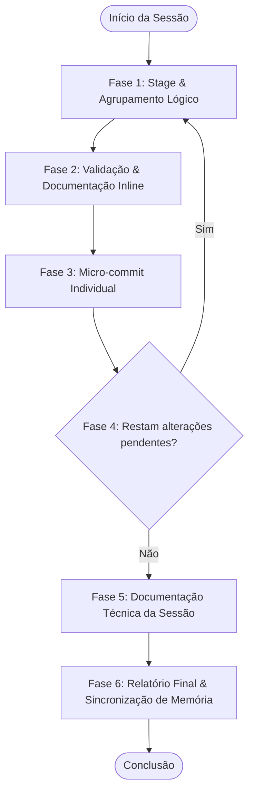
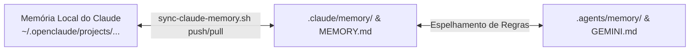

<!-- 
=================================================================================
LOG DE MANUTENÇÃO E ALTERAÇÕES DO DOCUMENTO
=================================================================================
Data       | Autor          | Descrição da Alteração
-----------|----------------|--------------------------------------------------
2026-08-06 | Matheus Diniz  | Criação do guia completo cobrindo as 6 fases do 
           |                | /commit-e-documentar, integracao com Graphify e 
           |                | sincronizacao bidirecional de memorias Duo.
=================================================================================
-->

# 📖 Guia Completo do Fluxo de Desenvolvimento, Commit, Documentação e Sincronização de Memórias

Este documento detalha passo a passo a metodologia oficial de engenharia de software e governança adotada no monorepo **MonFinTrack** (`CCAT-monFinTrack`). Ele serve como guia definitivo para desenvolvedores e agentes de Inteligência Artificial (Claude Code e Gemini CLI).

---

## 📐 1. Estrutura Arquitetural do Monorepo

O repositório **MonFinTrack** utiliza uma arquitetura plana modular orientada por repositórios e diretórios de governança:

```
CCAT-monFinTrack/                        # Repositório Raiz (Governança, Specs, Grafo e Memórias)
├── .agents/                             # Camada compartilhada global de IA (Regras, Personas, Workflows)
│   ├── rules/                           # Instruções globais (core-skills.md, GEMINI.md)
│   ├── memory/                          # Base de memórias espelhada do Gemini CLI
│   └── scripts/                         # Automações de verificação (checklist.py, verify_all.py)
├── .claude/                             # Configurações e memórias atreladas ao Claude Code
│   ├── memory/                          # Acervo versionado de memórias (.md e MEMORY.md)
│   └── sync-claude-memory.sh            # Script de sincronização bidirecional de memórias
├── agents/                              # Personas de subagentes (knowledge-graph-curator, etc.)
├── docs/                                # Documentação técnica centralizada
│   ├── specs/                           # Especificações funcionais e técnicas (Specs)
│   ├── plans/                           # Planos de implementação detalhados (Plans)
│   ├── commits/                         # Relatórios de desenvolvimento das sessões
│   └── guides/                          # Manuais e guias práticos do projeto
├── graphify-out/                        # Grafo de Conhecimento indexado (GraphRAG / Graphify)
├── backend/                             # Repositório do BFF em FastAPI (Python 3.13 / Firestore / Stripe)
├── frontend/                            # Repositório da aplicação Web Angular v20 (Tailwind)
├── CLAUDE.md                            # Diretrizes globais do Claude Code no repositório
└── GEMINI.md                            # Diretrizes globais do Gemini CLI no repositório
```

---

## 🔄 2. O Ciclo Determinístico em 6 Fases (`/commit-e-documentar`)

O fluxo de commit e documentação é executado em um loop contínuo e determinístico para garantir que nenhuma alteração fique sem validação, testes ou rastreabilidade.



---

### 🔹 Fase 1: Stage e Agrupamento Lógico por Afinidade

1. **Inspeção de Estado**: Execute o comando para obter o status em formato legível:
   ```bash
   git status --porcelain
   ```
2. **Agrupamento**: Separe as alterações por contexto lógico e componente. 
   - *Exemplo*: Arquivos de template HTML, lógica TypeScript de um componente Angular e seus modelos pertencem a um único grupo.
   - *Exemplo*: Guias técnicos ou rotas do FastAPI formam outro grupo no backend.
3. **Adição Seletiva**: Adicione ao staging area somente o grupo selecionado:
   ```bash
   git add caminho/do/arquivo1.ts caminho/do/arquivo2.html
   ```

---

### 🔹 Fase 2: Validação e Documentação Inline

Antes de confirmar qualquer commit:

1. **Documentação Inline (JSDoc/Docstrings)**:
   - Toda nova função, componente ou serviço deve possuir comentários explicativos em **pt-BR** descrevendo parâmetros, retornos e o motivo das decisões tomadas.
2. **Checagem Estática de Tipos e Build**:
   - **Frontend (Angular)**:
     ```bash
     cd frontend && npx tsc --noEmit
     ```
   - **Backend (FastAPI)**:
     ```bash
     cd backend && uv run pytest
     ```
   - *Se os testes ou checagens falharem, o commit é interrompido até a correção do problema.*

---

### 🔹 Fase 3: Micro-commits Isolados (Conventional Commits)

Cada grupo de alterações validado deve ser commitado individualmente seguindo o padrão **Conventional Commits**:

- **Formato**: `<tipo>(<escopo>): <descrição curta em pt-BR>`
- **Tipos Permitidos**:
  - `feat`: Nova funcionalidade para o usuário.
  - `fix`: Correção de bug.
  - `docs`: Alteração exclusivamente em documentação.
  - `style`: Ajustes visuais ou de formatação sem alterar lógica.
  - `refactor`: Mudança de código que não corrige bug nem adiciona funcionalidade.
  - `test`: Adição ou correção de testes.
  - `chore`: Tarefas de build, configurações de ferramentas ou grafo.

- **Comando seguro com HEREDOC**:
  ```bash
  git commit -m "$(cat <<'EOF'
  feat(gremio): implementar modulo de retirada e elegibilidade de brindes

  Adiciona suporte a eventos de entrega de brindes do Grêmio, incluindo o card de brindes elegíveis na visão do colaborador e a aba de administração com busca express.
  EOF
  )"
  ```

---

### 🔹 Fase 4: Repetição e Limpeza Completa

Repita as **Fases 1, 2 e 3** em cada diretório afetado (`frontend/`, `backend/`, raiz do `CCAT-monFinTrack`) até que `git status --porcelain` retorne 100% limpo em todos os diretórios.

---

### 🔹 Fase 5: Documentação Técnica da Sessão

Após concluir os micro-commits, gere um relatório consolidado em `docs/commits/YYYY-MM-DD_<escopo-principal>.md`.

#### Estrutura Obrigatória do Documento de Sessão:

1. **Cabeçalho com Metadados**: Data, Escopo, Quantidade de Commits e Arquivos Atingidos.
2. **Visão Geral das Alterações**: Resumo executivo em 2–4 frases.
3. **Diagrama Arquitetural (Mermaid)**: Mapeamento de fluxo entre serviços e componentes afetados.
4. **Mapa de Arquivos Modificados**: Tabela detalhando cada arquivo, seu tipo e o que mudou.
5. **Detalhamento por Commit**: Razão da alteração, comportamento atual e arquivos envolvidos.
6. **Status do Projeto**:
   - `✅ O Que Está Funcionando`: Lista de itens operacionais.
   - `❌ O Que Está Pendente`: Pendências ou bloqueios.
   - `⚠️ Dívida Técnica Identificada`: Oportunidades de refatoração futuras.
7. **Padrões Importantes & Validações Mapeadas**: Regras de negócio e tabela de testes de validação.

Após criar o arquivo, comite-o imediatamente:
```bash
git add docs/commits/YYYY-MM-DD_<escopo>.md
git commit -m "docs(commits): registra sessao de desenvolvimento de YYYY-MM-DD"
```

---

### 🔹 Fase 6: Relatório Final no Terminal

Exiba o resumo condensado no terminal:

```
📦 Commits gerados:
- feat(gremio): implementar modulo de retirada e elegibilidade de brindes
- docs(guidelines): atualizar diretrizes de specs e planos em CLAUDE.md

📄 Documentação gerada:
- docs/commits/YYYY-MM-DD_<escopo>.md

🔍 Dívidas técnicas encontradas: 0 item(ns)
📋 Próximos passos registrados: X item(ns)
```

---

## 🧭 3. Navegação por Grafo de Conhecimento (`graphify`)

O repositório possui um Grafo de Conhecimento estruturado em `graphify-out/` para navegação inteligente do código via IA.

### Regras de Uso:
1. **Graphify Antes de Grep/Glob**: O assistente deve realizar consultas conceituais no grafo antes de fazer buscas por texto puro:
   - `graphify query "<conceito ou duvida>"`: Retorna o subgrafo com as dependências.
   - `graphify path "<EntidadeA>" "<EntidadeB>"`: Mapeia o caminho entre duas estruturas.
   - `graphify explain "<arquivo_ou_funcao>"`: Explica o papel de um nó no sistema.
2. **Atualização do Grafo**: Sempre que arquivos fonte forem alterados ou criados, execute a reindexação do grafo:
   ```bash
   graphify update .
   ```

---

## 🧠 4. Sincronização Duo de Memórias (Claude Code + Gemini CLI)

Para garantir paridade de conhecimento, portabilidade de contexto e evitar a perda de aprendizados entre o **Claude Code** e o **Gemini CLI**, o projeto dispõe de uma infraestrutura automatizada de memórias versionadas via Git.



### Script de Sincronização (`sync-claude-memory.sh`):

Located em `./.claude/sync-claude-memory.sh`, o script gerencia a sincronização das memórias persistentes:

#### 1. Exportação/Push (Local -> Repositório Git):
Disparado sempre que novas diretrizes, feedbacks ou memórias de projeto forem aprendidas durante a conversa:
```bash
./.claude/sync-claude-memory.sh push
```
Isso copia os arquivos do diretório privado do Claude (`~/.openclaude/projects/.../memory/`) para o repositório em `./.claude/memory/`.

#### 2. Importação/Pull (Repositório Git -> Local):
Disparado ao iniciar a sessão ou puxar alterações do Git:
```bash
./.claude/sync-claude-memory.sh pull
```
Isso atualiza o ambiente local do assistente com o contexto acumulado pela equipe.

### Alinhamento com o Gemini CLI (`.agents/memory/`):
Sempre que uma memória for consolidada em `.claude/memory/`:
1. Atualize a regra equivalente ou convenção em `.agents/memory/project-conventions.md`.
2. Garanta que o índice `.agents/memory/MEMORY.md` esteja atualizado.
3. Faça o commit dos arquivos de memória em ambos os locais para que ambos os assistentes operem sob as mesmas regras.

---

## 📋 5. Checklist Diário de Qualidade

Antes de concluir qualquer ciclo de desenvolvimento, certifique-se de que:

- [ ] Especificações técnicas foram salvas em `docs/specs/`.
- [ ] Planos de implementação foram salvos em `docs/plans/`.
- [ ] Todos os micro-commits seguem a convenção `tipo(escopo): descrição`.
- [ ] Os testes e validações de tipos (`npx tsc --noEmit` / `pytest`) passaram sem alertas.
- [ ] O relatório da sessão foi gravado em `docs/commits/YYYY-MM-DD_<escopo>.md`.
- [ ] O Grafo de Conhecimento foi atualizado (`graphify update .`).
- [ ] As memórias foram consolidadas com `./.claude/sync-claude-memory.sh push` e espelhadas em `.agents/memory/`.

---
