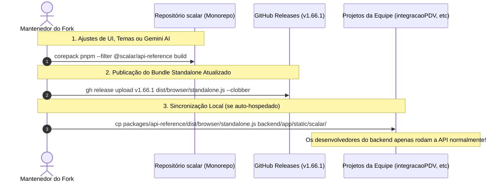

# 📖 Guia Técnico de Padronização Scalar via FastAPI Auto-Hospedado (Foco em DX)

<!-- 
=================================================================================
LOG DE MANUTENÇÃO E ALTERAÇÕES DO DOCUMENTO
=================================================================================
Data       | Autor          | Descrição da Alteração
-----------|----------------|--------------------------------------------------
2026-08-19 | Matheus Diniz  | Criação do Guia Técnico de Padronização Scalar
           | (OpenClaude)   | e OpenAPI 3.1 para o ecossistema institucional (v1.0.0).
2026-08-19 | Matheus Diniz  | Reescrita para v2.0.0: foco exclusivo no auto-hospedado
           | (OpenClaude)   | via integração FastAPI (pacote scalar-fastapi),
           |                | migração da API legada data-* para get_scalar_api_reference,
           |                | matriz completa de parâmetros reais, deploy/ambientes
           |                | e boas práticas de DX.
2026-08-21 | Matheus Diniz  | Atualização v2.1.0: Instalação e inicialização direta do
           | (Antigravity)  | Fork Customizado (@mat-dgruber/scalar) nos projetos com
           |                | suporte nativo a Google Gemini (BYOK / Model Selector).
2026-08-21 | Matheus Diniz  | Atualização v2.2.0: Adicionado guia de autenticação GitHub
           | (Antigravity)  | PAT para consumo dos pacotes @mat-dgruber pela equipe
           |                | e diretrizes de troubleshooting para Agentes de IA.
2026-08-21 | Matheus Diniz  | Atualização v2.3.0: Adicionado guia de uso do Servidor
           | (Antigravity)  | MCP (Model Context Protocol) nativo para integração de
           |                | agentes de IA (Cursor, Claude Desktop, Gemini CLI).
2026-08-24 | Matheus Diniz  | Atualização v2.4.0: Estratégias de distribuição do fork
           | (OpenClaude)   | standalone (Auto-hospedagem estática FastAPI vs GitHub
           |                | Releases) e troubleshooting do erro `Scalar is not defined`.
2026-08-24 | Matheus Diniz  | Atualização v2.5.0: Servidor MCP Autônomo e Modular
           | (OpenClaude)   | (@scalar/mcp-server) com descoberta OpenAPI dinâmica,
           |                | diagnósticos de infraestrutura, Zero-Trust e recursos nativos.
2026-08-24 | Matheus Diniz  | Atualização v2.6.0: Recursos Avançados de UI no Chat e MCP:
           | (OpenClaude)   | Integração direta OpenClaude & Antigravity no botão MCP,
           |                | injeção de contexto de endpoint no "Ask AI Agent" e
           |                | menções inteligentes de endpoints com `@` e `/` no chat.
2026-08-24 | Matheus Diniz  | Atualização v2.7.0: Ecossistema de DX e IA Expandido:
           | (Antigravity)  | Novo pacote @scalar/openapi-diff (breaking changes detector),
           |                | middleware universal scalarMcp (Hono/Express), tokens de
           |                | densidade compacta (.scalar-compact) e dereferenceAsync.
=================================================================================
-->

> **Este guia é o padrão para inicializar e utilizar o Scalar nos nossos projetos (pessoais e da empresa)**, utilizando o **Fork Customizado (`@mat-dgruber/scalar`)** que inclui suporte nativo a **Google Gemini AI (BYOK - Bring Your Own Key)**, correções críticas e distribuição auto-hospedada (FastAPI / Vue / React / Node / CDN).

**A regra que rege tudo:** a qualidade da doc depende do seu documento OpenAPI — o Scalar apenas renderiza o que a sua API expõe.

---

## 🚀 1. Inicialização e Instalação nos Projetos (Forma Principal)

Utilizamos a versão do fork `@mat-dgruber/scalar` para garantir suporte a IA com Google Gemini, correções de schema e performance.

> [!IMPORTANT]
> **Autenticação Obrigatória no GitHub Packages (Para Humanos e IAs)**
> Os pacotes sob o escopo `@mat-dgruber/*` estão hospedados no **GitHub Packages**. 
> Diferente do npm público tradicional, o GitHub Packages **sempre exige autenticação prévia** para download, mesmo que os pacotes sejam públicos.
> 
> - **Cada desenvolvedor deve gerar seu próprio PAT na sua própria conta GitHub** (não precisa ser na conta `mat-dgruber`, qualquer conta GitHub com PAT `read:packages` tem permissão de leitura).
> - **Nunca compartilhe tokens individuais em commits ou repositórios públicos.**

---

### 🔑 Pré-requisito: Configurar Autenticação GitHub Packages (Uma única vez por máquina)

Esse passo é feito **uma única vez por máquina** por cada membro da equipe e serve para todos os projetos:

#### 1. Gerar o token pessoal:
1. Acesse: [github.com → Settings → Developer settings → Personal access tokens → Tokens (classic)](https://github.com/settings/tokens/new)
2. Dê um nome (ex: `leitura-packages-scalar`)
3. Marque **apenas**: ✅ `read:packages` (Download packages from GitHub Package Registry)
4. Defina a validade (ex: 90 dias ou 1 ano)
5. Clique em **Generate token** e copie o código gerado (`ghp_...`).

#### 2. Configurar globalmente no terminal:
Execute os comandos abaixo substituindo `ghp_SEU_TOKEN` pelo token que você acabou de gerar:
```bash
npm config set //npm.pkg.github.com/:_authToken ghp_SEU_TOKEN
npm config set @mat-dgruber:registry https://npm.pkg.github.com
```

Após rodar esses dois comandos, qualquer `npm install`, `pnpm add` ou `yarn add` de `@mat-dgruber/*` funcionará normalmente e de forma transparente.

> [!TIP]
> **Para Ambientes de CI/CD (GitHub Actions, GitLab CI, Jenkins, Docker)**:
> Crie um arquivo `.npmrc` na raiz do projeto consumidor consumindo variável de ambiente:
> ```ini
> @mat-dgruber:registry=https://npm.pkg.github.com
> //npm.pkg.github.com/:_authToken=${NODE_AUTH_TOKEN}
> ```
> E configure o secret `NODE_AUTH_TOKEN` (ou `GITHUB_TOKEN`) nas variáveis do pipeline.

---

### 🤖 Instruções Mandatórias para Agentes de IA e Assistentes de Código (Antigravity, Cursor, Claude, Copilot)

> [!CAUTION]
> **Diretriz para o Agente de IA ao instalar ou atualizar pacotes `@mat-dgruber/*`:**
> 1. **Detecção de Falha de Autenticação (HTTP 401 / 403 / E401 / ERR_PNPM_FETCH_401):**
>    Se o comando de instalação (`npm install`, `pnpm add`, `yarn add`) falhar ao tentar baixar pacotes `@mat-dgruber/*`, a causa raiz é a falta do token de autenticação configurado no ambiente local do usuário.
> 2. **Ação Requerida da IA:**
>    - **NÃO** tente contornar o erro trocando arbitrariamente de pacote para a versão oficial `@scalar/*` sem autorização explícita (pois a versão oficial não contém o suporte ao Google Gemini BYOK e as customizações necessárias).
>    - **NÃO** tente adivinhar credenciais nem inserir senhas fictícias.
>    - **PAUSE** a execução e alerte o usuário humano imediatamente, fornecendo o link direto ([github.com/settings/tokens/new](https://github.com/settings/tokens/new)) e orientando-o a gerar seu token com o escopo `read:packages` e executar o comando de configuração global `npm config set //npm.pkg.github.com/:_authToken <seu_token>`.
> 3. **Confirmação:** Após o usuário confirmar que configurou o token, o agente pode prosseguir com a instalação normalmente.

---

### A. Instalação em Projetos Node / Vue / React / Next.js / NestJS

1. **Instalar o pacote** (após configurar o PAT acima):
   ```bash
   pnpm add @mat-dgruber/api-reference
   # ou com npm / yarn:
   npm install @mat-dgruber/api-reference
   ```

2. **Inicializar no seu código com Google Gemini:**

   ```typescript
   import { createApiReference } from '@mat-dgruber/api-reference'
   import '@mat-dgruber/api-reference/style.css'

   createApiReference('#app', {
     url: '/openapi.json',
     agent: {
       provider: 'gemini',
       gemini: {
         model: 'gemini-3.7-flash', // Padrão recomendado (ou gemini-2.5-pro, gemini-3.6-flash, etc.)
         apiKey: process.env.VITE_GEMINI_API_KEY, // Opcional (o usuário pode preencher via modal ⚙️ no chat)
       },
     },
   })
   ```

---

### B. Instalação e Uso em Projetos Angular (ex: `despesas-web`)

No Angular (Standalone Components ou Tradicional), o Scalar deve ser montado no ciclo de vida `AfterViewInit` utilizando um `ElementRef` e com `ViewEncapsulation.None` para garantir que o tema, os modais e o chat do Gemini renderizem perfeitamente:

1. **Instalar o pacote:**
   ```bash
   npm install @mat-dgruber/api-reference
   ```

2. **Criar o componente `ScalarDocsComponent` (`scalar-docs.component.ts`):**

   ```typescript
   import { Component, ElementRef, AfterViewInit, ViewChild, ViewEncapsulation } from '@angular/core';
   import { createApiReference } from '@mat-dgruber/api-reference';
   import '@mat-dgruber/api-reference/style.css';

   @Component({
     selector: 'app-scalar-docs',
     standalone: true,
     template: `
       <div #scalarContainer class="scalar-container"></div>
     `,
     styles: [`
       .scalar-container {
         width: 100%;
         height: 100vh;
         overflow-y: auto;
       }
     `],
     // ViewEncapsulation.None garante que o estilo e temas do Scalar se apliquem corretamente
     encapsulation: ViewEncapsulation.None,
   })
   export class ScalarDocsComponent implements AfterViewInit {
     @ViewChild('scalarContainer', { static: true }) scalarContainer!: ElementRef<HTMLDivElement>;

     ngAfterViewInit(): void {
       if (this.scalarContainer?.nativeElement) {
         createApiReference(this.scalarContainer.nativeElement, {
           url: 'https://api-gsd.cpb.com.br/v2/openapi.json', // ou sua URL da API
           agent: {
             provider: 'gemini',
             gemini: {
               model: 'gemini-3.7-flash', // Padrão recomendado
               // apiKey: 'opcional' -> o usuário pode configurar pelo modal ⚙️ no chat
             },
           },
         });
       }
     }
   }
   ```

---

### C. Inicialização em Projetos FastAPI / Python (Auto-Hospedado)

Para projetos FastAPI utilizando o pacote oficial `scalar-fastapi` integrado ao nosso fork com suporte ao Google Gemini e novos temas, temos duas estratégias principais de distribuição do script:

#### Opção 1: Auto-Hospedagem Estática Local (100% Offline / VPN Safe / Recomendada por Projeto)

Ideal para repositórios individuais (como `integracaoPDV`), garantindo disponibilidade total sem depender de rede externa ou GitHub.

1. **Compilar e copiar o bundle do fork:**
   ```bash
   # No repositório scalar:
   pnpm --filter @scalar/api-reference build:standalone
   # Copiar dist/browser/standalone.js para app/static/scalar/standalone.js do seu projeto FastAPI
   ```

2. **Configurar no `main.py`:**
   ```python
   from pathlib import Path
   from fastapi import FastAPI
   from fastapi.staticfiles import StaticFiles
   from scalar_fastapi import Layout, Theme, get_scalar_api_reference

   app = FastAPI(title="Minha API", openapi_url="/openapi.json")

   # 1. Montar arquivos estáticos locais
   STATIC_DIR = Path(__file__).resolve().parent / "static"
   if STATIC_DIR.exists():
       app.mount("/static", StaticFiles(directory=str(STATIC_DIR)), name="static")


   # 2. Servir rota /scalar apontando para o bundle local
   @app.get("/scalar", include_in_schema=False)
   def scalar_docs():
       return get_scalar_api_reference(
           openapi_url=app.openapi_url,
           title=f"{app.title} - Documentação Interativa",
           layout=Layout.MODERN,
           theme=Theme.KEPLER,
           show_sidebar=True,
           persist_auth=True,
           scalar_js_url="/static/scalar/standalone.js",
       )
   ```

---

#### Opção 2: Distribuição Centralizada via GitHub Releases (Ideal para Múltiplas APIs)

Para consumir o bundle compilado do fork diretamente pela web sem clonar ou compilar o JavaScript em cada projeto backend:

```python
from fastapi import FastAPI
from scalar_fastapi import Layout, Theme, get_scalar_api_reference

app = FastAPI(title="Minha API", openapi_url="/openapi.json")


@app.get("/scalar", include_in_schema=False)
def scalar_docs():
    return get_scalar_api_reference(
        openapi_url=app.openapi_url,
        title=f"{app.title} - Documentação Interativa",
        layout=Layout.MODERN,
        theme=Theme.KEPLER,
        show_sidebar=True,
        persist_auth=True,
        # Carrega o bundle mais recente diretamente das Releases públicas do GitHub:
        scalar_js_url="https://github.com/mat-dgruber/scalar/releases/latest/download/standalone.js",
    )
```

> [!WARNING]
> **Troubleshooting: Por que `jsDelivr` retornava 404 e gerava `Scalar is not defined`?**
> - CDNs públicas como `cdn.jsdelivr.net` e `unpkg.com` indexam exclusivamente o registro público do npm (`registry.npmjs.org`).
> - Como o escopo `@mat-dgruber/*` é hospedado no **GitHub Packages** (`npm.pkg.github.com`), o jsDelivr não consegue acessá-lo publicamente, retornando `404 Not Found`.
> - Quando o script falha com 404, o objeto global `window.Scalar` não é registrado, e o script inline falha imediatamente com `Uncaught ReferenceError: Scalar is not defined`.
> - **Solução:** Utilize a **Opção 1 (bundle estático local)** ou a **Opção 2 (GitHub Releases)**.

---

### D. Como Funciona a Seleção de Modelos e BYOK no Chat

O Scalar integrado com Gemini possui um seletor visual e persistência automática:
- **Modelos Frontier (3.x)**: `gemini-3.7-flash` (Padrão), `gemini-3.6-flash`, `gemini-3.5-flash`, `gemini-3.1-pro`, `gemini-3.1-flash-lite`.
- **Modelos Stable (2.5)**: `gemini-2.5-pro`, `gemini-2.5-flash`.
- **Modelos Customizados**: Qualquer modelo suportado pela API do Google.
- **Hierarquia de Precedência:** `localStorage (Configurado via modal ⚙️ pelo usuário)` > `Props passadas no código` > `Default (gemini-3.7-flash)`.

---

### E. Como Usar o Servidor MCP Autônomo e Modular (`@scalar/mcp-server`)

O nosso fork disponibiliza o pacote `@scalar/mcp-server`, um **Servidor MCP 100% autônomo, desacoplado e de execução local via Stdio**. Ele permite que assistentes de IA (**OpenClaude**, **Antigravity**, **Cursor** e **Claude Desktop**) descubram, testem e diagnostiquem APIs da sua infraestrutura sem depender de nenhum serviço de nuvem ou proxy externo da Scalar.

#### 💡 Por Que Usar o `@scalar/mcp-server`?

1. **Privacidade e Zero-Trust**: O servidor roda como subprocesso local da sua máquina. Cabeçalhos (`Authorization`, `X-Api-Key`, `Cookie`) e payloads sensíveis (`password`, `secret`, `token`) são mascarados automaticamente antes de chegar ao LLM.
2. **Descoberta Dinâmica de OpenAPI**: Não precisa cadastrar endpoints manualmente. O MCP detecta arquivos `openapi.json`, `swagger.json` ou o servidor Scalar em execução e cria um catálogo dinâmico de ferramentas.
3. **Diagnósticos Reais de Infraestrutura**: Mede latência real de rede em milissegundos (HTTP ping) e fornece relatórios de saúde dos microsserviços.
4. **Multi-Ambiente Dinâmico**: Permite que o agente alterne entre `local`, `dev` e `staging` durante a sessão sem reiniciar o servidor.
5. **Recursos Nativos (MCP Resources)**: Fornece `openapi://spec` e `infra://health-status` como documentos legíveis diretamente pelo protocolo MCP.

---

#### ⚙️ 1. Configuração Global (Recomendada — 1 Vez por Máquina)

Ao configurar globalmente, o servidor MCP fica disponível automaticamente em **qualquer pasta ou projeto** que você abrir no terminal:

##### A. No OpenClaude (`~/.claude.json`):
Adicione em `mcpServers` no seu arquivo `~/.claude.json`:
```json
{
  "mcpServers": {
    "meu-mcp-server": {
      "type": "stdio",
      "command": "npx",
      "args": [
        "-y",
        "tsx",
        "/Users/matheus.diniz_1/Documents/GitHub/scalar/packages/mcp-server/src/index.ts"
      ],
      "env": {
        "INTERNAL_API_URL": "http://localhost:5052",
        "INTERNAL_API_TOKEN": "local-dev-token"
      }
    }
  }
}
```

##### B. No Antigravity (`~/.antigravity/mcp.json`):
Crie ou edite `~/.antigravity/mcp.json`:
```json
{
  "mcpServers": {
    "meu-mcp-server": {
      "command": "npx",
      "args": [
        "-y",
        "tsx",
        "/Users/matheus.diniz_1/Documents/GitHub/scalar/packages/mcp-server/src/index.ts"
      ],
      "env": {
        "INTERNAL_API_URL": "http://localhost:5052",
        "INTERNAL_API_TOKEN": "local-dev-token"
      }
    }
  }
}
```

---

#### 📁 2. Configuração por Projeto (Opcional — Comitado no Git)

Para que todos os desenvolvedores que clonarem o repositório tenham acesso imediato:

- Crie `.mcp.json` (para OpenClaude / Cursor) e `.antigravity/mcp.json` (para Antigravity) na raiz do projeto com o comando relativo.

---

#### 🛠️ 3. Catálogo de Ferramentas (Tools) Disponíveis para o Agente

| Ferramenta | Entrada (`inputSchema`) | Finalidade e Exemplo |
| :--- | :--- | :--- |
| `openapi_descobrir_rotas` | `{ query?: string, tag?: string, metodo?: string }` | **Busca semântica e estruturada de endpoints**.<br>Ex: Filtrar rotas com tag `Usuarios` ou método `POST`. |
| `openapi_executar_requisicao` | `{ endpoint: string, metodo: string, params?: object, payload?: object, headers?: object, ambiente?: string }` | **Dispara chamadas REST autenticadas** contra a API ativa com injeção automática de token e sanitização de segurança. |
| `infra_diagnosticar_servico` | `{ url?: string, timeoutMs?: number }` | **Mede conectividade e latência em ms**.<br>Retorna status `UP`/`DOWN`, tempo de resposta e diagnóstico de erro se o serviço cair. |
| `ambiente_gerenciar` | `{ acao: 'listar' \| 'obter' \| 'trocar', ambiente?: 'local' \| 'dev' \| 'staging' }` | **Gerencia ambientes de execução**.<br>Permite ao agente alternar o target entre ambiente local e servidores de homologação/dev. |

---

#### 📄 4. Recursos Nativos (MCP Resources)

O agente de IA pode inspecionar recursos sem executar ferramentas ativas:

1. **`openapi://spec`**: Retorna a especificação OpenAPI completa carregada do projeto para o LLM planejar arquitetura e integrações.
2. **`infra://health-status`**: Fornece um snapshot consolidado da conectividade de todos os serviços monitorados.

---

#### 🖱️ 5. Integração com a UI do Scalar

Na interface visual do Scalar, o botão MCP (na barra lateral superior) foi totalmente integrado aos agentes locais de desenvolvimento e desacoplado de redirecionamentos externos:

- **VS Code**: Instalação direta via deep link `vscode:mcp/install`.
- **Cursor**: Instalação direta via deep link `cursor://anysphere.cursor-deeplink/mcp/install`.
- **Antigravity (MCP)**: Copia a configuração JSON completa formatada para o `~/.antigravity/mcp.json` ou arquivo local com um clique e toast de feedback.
- **OpenClaude (CLI)**: Copia o comando `claude mcp add` pronto para o terminal do desenvolvedor.
- **Copiar URL**: Copia a URL do endpoint local (`/mcp` ou `http://localhost:5052/mcp`) com toast de confirmação.

---

#### 🎯 6. Contexto Automático de Endpoint no "Ask AI Agent"

Ao navegar pela documentação e clicar no botão **"Ask AI Agent"** (no cabeçalho superior direito do card de qualquer endpoint):

1. **Injeção de Metadados**: O Scalar injeta automaticamente o contexto da rota ativa no formato `[Endpoint: {METODO} {/path} ({Summary})]`.
2. **Pergunta Rápida**: Se o desenvolvedor clicar no botão sem digitar nada, o chat abre automaticamente solicitando uma explicação completa do funcionamento, parâmetros, payload esperado e códigos de retorno daquela rota.
3. **Pergunta Customizada**: Se o desenvolvedor digitar uma pergunta específica no campo da rota (ex: *"como autenticar?"*), ela é enviada junto com o cabeçalho contextual do endpoint.

---

#### 🏷️ 7. Menções e Autocomplete de Endpoints no Chat com `@` e `/`

Para referenciar rotas específicas dentro de qualquer conversa aberta no chat:

1. **Gatilho de Autocomplete**: Ao digitar `@` ou `/` na caixa de entrada do prompt, um menu suspenso inteligente é exibido acima do campo.
2. **Badges Coloridos de Métodos**: Os endpoints são listados com badges com as cores padrão da OpenAPI (`GET` em azul, `POST` em verde, `PUT`/`PATCH` em amarelo, `DELETE` em vermelho).
3. **Filtro em Tempo Real**: Digitar após o `@` ou `/` (ex: `@/users` ou `/auth`) filtra dinamicamente os endpoints por caminho ou sumário.
4. **Navegação pelo Teclado**:
   - `↑` e `↓`: Navegam pela lista suspensa.
   - `Enter`: Seleciona o endpoint e o insere no prompt no formato `[Endpoint: METODO /caminho]`.
   - `Esc`: Fecha a lista de menção.

---

## 🔧 2. Migração da API Legada `data-*` (Importante)

### A. Migrar da API legada `data-*` (Obrigatório)

A v1 usava `<script id="api-reference" data-url data-configuration>`. Esse é o caminho **legado**. O padrão oficial atual do Scalar é o método JavaScript `Scalar.createApiReference('#app', {...})`. No FastAPI você não escreve nem um nem outro à mão: o pacote `scalar-fastapi` gera o HTML por você e internamente chama `createApiReference`. Trocar HTML manual pela função é a mudança central desta versão.

### B. Usar o pacote first-party, não HTML (Obrigatório)

A v1 servia uma string HTML gigante dentro de `HTMLResponse`. Substitua por `get_scalar_api_reference()`. Você ganha tipagem, defaults corretos, enums (`Layout`, `Theme`, `SearchHotKey`), suporte a múltiplas fontes e configuração de Agent — sem manter HTML frágil no código Python.

### C. Nomes de parâmetro mudam

O objeto JS usa `camelCase`; o pacote Python usa `snake_case`. A tabela da v1 (`persistAuth`, `hideModels`, `searchHotKey`…) descreve a config JS. No FastAPI os nomes reais são `persist_auth`, `hide_models`, `search_hot_key`.

- `proxyUrl` → `scalar_proxy_url`
- `hideDownloadButton` → **deprecado**; use `document_download_type`
- `defaultHttpClient` não é parâmetro direto — passe via `overrides`

---

## 🚀 2. Setup Inicial (Executado Apenas Uma Vez)

### A. Instalar

```bash
pip install scalar-fastapi
# ou, no padrão uv do monorepo:
uv add scalar-fastapi
```

Fixe a versão no lockfile (`uv.lock` / `requirements.txt`) para builds reprodutíveis, alinhado ao princípio de pinning já adotado nos demais guias.

### B. Metadados Globais e Tags

As `tags` viram a estrutura da sidebar do Scalar. Declare-as com descrição. Título, versão e descrição do `FastAPI(...)` viram o cabeçalho da doc.

```python
from fastapi import FastAPI

tags_metadata = [
    {
        "name": "Segurança & Autenticação",
        "description": "Login LDAP, renovação e revogação de token.",
    },
    {
        "name": "Swile Benefícios",
        "description": "Saldos, cartões flexíveis e transferências entre carteiras.",
    },
]

app = FastAPI(
    title="meuCPB API",
    version="1.0.0",
    description="Backend for Frontend (BFF) unificado do ecossistema meuCPB.",
    openapi_tags=tags_metadata,
    openapi_url="/openapi.json",  # fonte viva da spec
)
```

### C. A Rota `/scalar` (Núcleo)

Uma rota que devolve a página do Scalar apontando para o OpenAPI da própria app.

```python
from scalar_fastapi import get_scalar_api_reference


@app.get("/scalar", include_in_schema=False)
async def scalar_html():
    return get_scalar_api_reference(
        openapi_url=app.openapi_url,  # /openapi.json gerado pelo FastAPI
        title=app.title,
        scalar_proxy_url="https://proxy.scalar.com",  # evita CORS no "Test Request"
    )
```

- `include_in_schema=False` mantém a própria rota de docs fora do OpenAPI — não polui o spec.
- `app.openapi_url` em vez de string fixa: mudou o prefixo, a doc acompanha.
- O clássico `/docs` (Swagger UI) continua existindo; decida se mantém os dois.

### D. Múltiplas APIs numa Página

Se você serve mais de um documento (ex.: API pública e API admin), use `sources`.

```python
from scalar_fastapi import get_scalar_api_reference, OpenAPISource


@app.get("/scalar", include_in_schema=False)
async def scalar_html():
    return get_scalar_api_reference(
        sources=[
            OpenAPISource(title="User API", url="/openapi.json", default=True),
            OpenAPISource(title="Admin API", url="/admin/openapi.json"),
        ],
        title="Documentação da API",
    )
```

`default=True` define qual documento abre primeiro. Cada fonte aceita `title`, `slug`, `url` ou `content` (mutuamente exclusivos) e um `agent` próprio.

---

## 🔒 3. Autenticação: o Dual-Scheme que Salva a DX

### A. O Erro que Quebra o Console (Crítico)

Configurar só `OAuth2PasswordBearer` força o Scalar a autenticar via formulário `x-www-form-urlencoded`; APIs JSON respondem `422` e o dev não consegue colar o Bearer. A correção é expor dois esquemas ao mesmo tempo: `HTTPBearer` (colar o JWT direto) e `OAuth2PasswordBearer` (documentar escopos RBAC).

### B. Padrão Recomendado

```python
from fastapi.security import HTTPBearer, OAuth2PasswordBearer

# Colagem direta do Bearer Token no Scalar / Swagger
http_bearer = HTTPBearer(
    auto_error=False,
    description="Insira o Token JWT retornado em /api/v1/auth/login",
)

# Especificação formal de escopos RBAC
oauth2_scheme = OAuth2PasswordBearer(
    tokenUrl="/api/v1/auth/login",
    scopes={
        "colaborador": "Acesso padrão.",
        "admin": "Acesso administrativo.",
    },
    auto_error=False,
)
```

A dependência `get_current_active_user` resolve o token em cascata: Cookie HttpOnly → cabeçalho Bearer → OAuth2, exatamente como descrito no Guia de Segurança (ADR 0033).

### C. Pré-preencher Auth = Maior Ganho de DX

Faça o dev testar em segundos com `authentication` + `persist_auth=True`.

```python
get_scalar_api_reference(
    openapi_url=app.openapi_url,
    persist_auth=True,  # lembra o token entre reloads (localStorage)
    authentication={
        "preferredSecurityScheme": "HTTPBearer",
        "securitySchemes": {
            "HTTPBearer": {"token": "cole-um-token-de-exemplo"},
        },
    },
)
```

Suporta API Key, HTTP Bearer, HTTP Basic e OAuth2 (incluindo PKCE). Nunca cole segredo real de produção aqui — apenas token de sandbox, seguindo a regra de "nunca credenciais reais".

---

## ⚙️ 4. Cada Função do Scalar (API Real do Pacote)

Assinatura de `get_scalar_api_reference()`. Nomes e defaults verificados na documentação oficial do `scalar-fastapi`.

### A. Núcleo e Fontes

| Parâmetro | Default | Função |
| :--- | :--- | :--- |
| `openapi_url` | `None` | URL do OpenAPI a carregar. Ignorado se `content`/`sources` forem passados. |
| `content` | `None` | Passa o documento OpenAPI direto (string JSON/YAML ou dict). |
| `sources` | `None` | Lista de `OpenAPISource` para renderizar várias APIs. |
| `title` | `"Scalar"` | Título da página de referência. |

### B. Exibição

| Parâmetro | Default | Função |
| :--- | :--- | :--- |
| `layout` | `Layout.MODERN` | `CLASSIC` replica o visual do Swagger UI. |
| `show_sidebar` | `True` | Navegação lateral com tags e endpoints. |
| `hide_models` | `False` | Esconde a seção de Schemas/Models. |
| `hide_search` | `False` | Esconde a barra de busca. |
| `hide_test_request_button` | `False` | Remove o botão "Test Request". |
| `document_download_type` | `BOTH` | Formato de download: `JSON`, `YAML`, `BOTH`, `NONE`. |
| `show_developer_tools` | `"localhost"` | Painel dev: `"always"`, `"localhost"`, `"never"`. |

*Depreciado:* `hide_download_button` — use `document_download_type`.

### C. Tema e Aparência

| Parâmetro | Default | Função |
| :--- | :--- | :--- |
| `theme` | `Theme.DEFAULT` | Tema da interface (`DEFAULT` ou `NONE` no enum do pacote). |
| `dark_mode` | `True` | Estado inicial do tema. |
| `force_dark_mode_state` | `None` | Trava em `'dark'` ou `'light'`. |
| `hide_dark_mode_toggle` | `False` | Esconde o botão de alternar tema. |
| `with_default_fonts` | `True` | Inter + JetBrains Mono; desligue para usar as suas. |
| `custom_css` | `""` | CSS próprio para casar com a marca. |

### D. Busca, Navegação e Schemas

| Parâmetro | Default | Função |
| :--- | :--- | :--- |
| `search_hot_key` | `SearchHotKey.K` | Atalho de busca; `CMD_K` ou `NONE`. |
| `default_open_all_tags` | `False` | Abre todas as tags de início. |
| `expand_all_model_sections` | `False` | Expande todos os models. |
| `expand_all_responses` | `False` | Expande todas as respostas. |
| `order_required_properties_first` | `True` | Campos obrigatórios primeiro no schema. |
| `order_schema_properties_by` | `"alpha"` | `"alpha"` ou `"preserve"`. |

### E. Servidores e Clientes de Snippet

| Parâmetro | Default | Função |
| :--- | :--- | :--- |
| `servers` | `[]` | Lista de Server Objects (prod/staging) para o dev escolher. |
| `base_server_url` | `""` | Prefixa servidores relativos com uma base URL. |
| `hidden_clients` | `[]` | Oculta linguagens/clientes de snippet irrelevantes. |
| `hide_client_button` | `False` | Esconde o botão do cliente na sidebar/modal. |

### F. Avançado e Agent

| Parâmetro | Default | Função |
| :--- | :--- | :--- |
| `scalar_js_url` | CDN jsdelivr | Fixe uma versão específica do renderer (pinning) ou aponte para CDN própria/offline. |
| `scalar_proxy_url` | `None` | Contorna CORS no cliente de teste. |
| `overrides` | `{}` | Injeta chaves cruas no config JS final (`defaultHttpClient`, `pathRouting`…). |
| `telemetry` | `True` | Desligue para não enviar telemetria de uso do cliente. |
| `agent` | `None` | `AgentScalarConfig(disabled=True)` desliga o chat de IA; `key=...` habilita em produção. |

### G. `defaultHttpClient` via `overrides`

Como não há parâmetro direto no pacote, defina o snippet padrão pelo `overrides`:

```python
get_scalar_api_reference(
    openapi_url=app.openapi_url,
    overrides={
        "defaultHttpClient": {"targetKey": "python", "clientKey": "httpx"},
    },
)
```

---

## 🌐 5. Deploy, Integração e Ambientes

### A. Não Há Deploy Separado (O Padrão)

Como a doc é uma rota da sua app FastAPI, ela sobe no mesmo deploy da API. Seu pipeline atual já publica a doc. Não existe passo de "publicar docs" à parte, nem workflow dedicado — essa é a vantagem central do auto-hospedado por integração.

**Barra de Ferramentas Interna:** O botão *Integrate* na toolbar do developer tools oferece snippets prontos para Express, Fastify, NestJS, Hono, FastAPI e HTML/CDN — tudo 100% client-side, sem envio de dados a serviços externos. O botão *Share* permite exportar o spec em JSON/YAML ou gerar um link de prévia comprimido na URL (`#spec=...`), também sem servidor externo.

- Fixe a versão do renderer via `scalar_js_url` apontando para uma versão específica da CDN, evitando quebra por atualização automática.
- Para ambiente offline/air-gapped, hospede o bundle do `@scalar/api-reference` na sua própria CDN e aponte `scalar_js_url` para lá.

### B. Config por Ambiente

Ajuste o comportamento conforme o ambiente para não expor coisas demais em produção:

```python
import os
from scalar_fastapi import get_scalar_api_reference, AgentScalarConfig

IS_PROD = os.getenv("ENV") == "production"


@app.get("/scalar", include_in_schema=False)
async def scalar_html():
    return get_scalar_api_reference(
        openapi_url=app.openapi_url,
        scalar_proxy_url="https://proxy.scalar.com",
        show_developer_tools="never" if IS_PROD else "localhost",
        agent=AgentScalarConfig(disabled=True),
        servers=[
            {"url": "https://api.example.com", "description": "Production"},
            {"url": "https://staging.example.com", "description": "Staging"},
        ],
    )
```

### C. Chat de IA (Agent) — Cuidado em Produção

O Agent adiciona um chat de IA sobre sua API. Vem ligado só em `localhost` (mensagens grátis limitadas) e não aparece em produção sem uma chave. Se você não quer isso, desative explicitamente com `AgentScalarConfig(disabled=True)`.

*Observação de privacidade:* quando o Agent é usado, seu documento OpenAPI é enviado ao Scalar na primeira mensagem. Para um setup 100% auto-contido — coerente com o Guia de Segurança e a sandbox `ai-jail` — mantenha desativado.

### D. Integração e Sincronia sem Plano Pago (Portal Estático Opcional)

Se você quiser publicar a doc como HTML estático fora da app (portal público separado), reproduza o "deploy no merge" sem pagar plano com um workflow de GitHub Actions. O FastAPI continua a fonte de verdade: você exporta o `openapi.json` no build e publica junto com o HTML do Scalar.

```yaml
name: Publicar docs estáticas

on:
  push:
    branches: [main]

jobs:
  build-docs:
    runs-on: ubuntu-latest
    steps:
      - uses: actions/checkout@v4
      - uses: actions/setup-python@v5
        with:
          python-version: "3.13"
      - name: Instalar deps e exportar OpenAPI
        run: |
          uv sync
          uv run python -c "import json, app.main as m; \
            open('site/openapi.json','w').write(json.dumps(m.app.openapi()))"
      - name: Gerar index.html do Scalar (aponta para ./openapi.json)
        run: |
          cat > site/index.html <<'HTML'
          <!doctype html><html><head><meta charset="utf-8">
          <title>API Docs</title></head><body><div id="app"></div>
          <script src="https://cdn.jsdelivr.net/npm/@scalar/api-reference@1.25.0"></script>
          <script>Scalar.createApiReference('#app', { url: './openapi.json' })</script>
          </body></html>
          HTML
      - name: Publicar no GitHub Pages
        uses: actions/upload-pages-artifact@v3
        with:
          path: site
```

---

## ✨ 6. Boas Práticas de Documentação e DX

### A. O Trabalho Está no Spec, Não no Scalar (Regra de Ouro)

O Scalar renderiza exatamente o que o FastAPI gera. Doc boa é spec bom. No FastAPI isso significa caprichar nos elementos que viram o OpenAPI:

- `summary` e `description` em cada rota (docstrings viram descrição, com Markdown).
- `response_model` e status codes explícitos em `responses={}` (`400`, `401`, `403`, `404`, `409`, `422`).
- `tags` consistentes nos endpoints — elas viram a estrutura da sidebar.
- Models Pydantic com `Field(..., description=..., examples=[...])` e `json_schema_extra` para exemplos ricos que pré-preenchem o console.
- `title`, `version` e `description` no `FastAPI(...)`.

### B. Decisões de Exposição

- `include_in_schema=False` na rota de docs e em endpoints internos que não devem aparecer.
- Em produção, decida se `/scalar` é público ou protegido — se for interno, coloque atrás de auth/rede privada.
- `show_developer_tools="never"` em produção.
- Agent desativado se você não quer enviar o spec a terceiros.
- Nunca use credenciais reais em `authentication`; só tokens de exemplo.

### C. Reprodutibilidade e Consistência entre Projetos

- Pin da versão do renderer (`scalar_js_url`) e do pacote (`scalar-fastapi`) para builds estáveis.
- Padronize a config numa função utilitária reutilizável entre projetos, variando só título e servidores.
- Escolha uma rota canônica (`/scalar`) e um tema únicos para todos os serviços da organização.
- Se mantiver o `/docs` do Swagger em paralelo, deixe claro qual é a doc oficial para evitar confusão.

### D. Função Utilitária Padrão (Copie entre Serviços)

Centralize a config numa única função; cada serviço só passa título e servidores. É o equivalente, no auto-hospedado, ao "template versionado" dos demais guias.

```python
from scalar_fastapi import get_scalar_api_reference, AgentScalarConfig, Theme


def docs_scalar(app, servers):
    return get_scalar_api_reference(
        openapi_url=app.openapi_url,
        title=app.title,
        theme=Theme.DEFAULT,
        scalar_proxy_url="https://proxy.scalar.com",
        persist_auth=True,
        agent=AgentScalarConfig(disabled=True),
        servers=servers,
        authentication={"preferredSecurityScheme": "HTTPBearer"},
        scalar_js_url="https://cdn.jsdelivr.net/npm/@scalar/api-reference@1.25.0",
    )
```

---

## 🚦 7. Checklist de Lançamento (Definition of Done)

- [ ] **Spec rico**: descrições, exemplos (`json_schema_extra`), tags e `response_model`.
- [ ] **Rota `/scalar`**: configurada com `include_in_schema=False` e `scalar_proxy_url`.
- [ ] **Dual-scheme**: `HTTPBearer` + `OAuth2PasswordBearer` para o console não quebrar com `422`.
- [ ] **Servers**: lista explícita com prod e staging.
- [ ] **Versões fixas**: pinning do pacote (`scalar-fastapi`) e renderer (`scalar_js_url`).
- [ ] **Developer tools e Agent**: ajustados por ambiente (`disabled=True` se não autorizado).
- [ ] **Auth de exemplo**: pré-preenchida sem expor segredos reais.
- [ ] **Decisão de exposição**: rota `/scalar` pública ou sob VPN/Auth de gateway.
- [ ] **Validação E2E**: endpoint testado no console interativo `/scalar` com token válido.

---

## ⚡ 8. Performance & Otimizações para Especificações Massivas (>5MB)

Quando aplicações manipulam especificações OpenAPI muito grandes (como ecossistemas Stripe, Kubernetes ou AWS com milhares de rotas e esquemas complexos), boas práticas de reatividade e renderização devem ser seguidas para evitar alto consumo de heap e travamentos no navegador:

### A. Reatividade Superficial (`shallowRef` e `markRaw`)
- Não envolva esquemas de resposta estáticos ou árvores de nós imutáveis em proxies profundos (`ref()` / `reactive()`).
- Utilize `markRaw()` para objetos de especificação desreferenciados que não sofrem mutações dinâmicas após o carregamento inicial.

### B. Renderização Lazy com `IntersectionObserver`
- O Scalar adota internamente o padrão `Lazy.vue` para componentes de rotas e modelos, montando no DOM apenas os blocos que entram na viewport visível do usuário.
- Para coleções extensas, mantenha a sidebar em modo compacto (`default_open_all_tags=False`) e evite expansão forçada de todos os modelos (`expand_all_model_sections=False`).

### C. Desreferenciação Assíncrona
- Para documentos massivos, priorize o pré-processamento de `$ref` em tempo de build/servidor ou via workers assíncronos, reduzindo a carga síncrona na thread principal da interface.

---

## 🛠️ 9. Fluxo de Manutenção Simplificado e Ciclo de Vida do Fork

Para manter a documentação de todos os projetos da equipe sempre atualizada, estável e com esforço operacional mínimo (zero overhead de build nos backends):



### 📋 As 2 Regras de Ouro para Manutenção Zero-Stress

1. **Nos Backends Consumidores (`main.py`):**
   - Use `scalar_js_url="/static/scalar/standalone.js"` (se self-hosted) ou `scalar_js_url="https://github.com/mat-dgruber/scalar/releases/download/v1.66.1/standalone.js"`.
   - Não instale ferramentas de frontend (Node, Vite, Tailwind) no backend FastAPI. O bundle standalone é auto-suficiente e zero-build.

2. **No Fork (`mat-dgruber/scalar`):**
   - Após criar temas, refatorar componentes ou ajustar transportes de IA, execute:

     ```bash
     # 1. Compilar o bundle standalone
     corepack pnpm --filter @scalar/api-reference build

     # 2. Publicar no GitHub Release v1.66.1 (para todos os projetos)
     gh release upload v1.66.1 packages/api-reference/dist/browser/standalone.js --clobber --repo mat-dgruber/scalar

     # 3. Atualizar no projeto local (exemplo: integracaoPDV)
     cp packages/api-reference/dist/browser/standalone.js /Users/matheus.diniz_1/Documents/GitHub/integracaoPDV/backend/app/static/scalar/standalone.js
     ```

   - Pronto! Todos os projetos recebem as melhorias instantaneamente.

---

## 🔍 10. Análise Semântica de Mudanças & CI/CD Gate (`@scalar/openapi-diff`)

Para proteger os clientes em produção contra *breaking changes* acidentais na API, utilize o `@scalar/openapi-diff` em scripts de validação de PR ou pipelines de CI:

```typescript
import { diffOpenApi, formatDiffMarkdown } from '@scalar/openapi-diff'
import { readFileSync } from 'node:fs'

const specProducao = JSON.parse(readFileSync('./openapi.prod.json', 'utf-8'))
const specNova = JSON.parse(readFileSync('./openapi.dev.json', 'utf-8'))

const diff = diffOpenApi(specProducao, specNova)

console.log(`Recomendação SemVer: ${diff.recommendedBump.toUpperCase()}`)

if (diff.breaking.length > 0) {
  console.error('🚨 Breaking changes detectadas!')
  console.log(formatDiffMarkdown(diff))
  process.exit(1) // Bloqueia o merge da PR ou deploy
}
```

---

## 🤖 11. Middleware Universal MCP para Backends (`scalarMcp`)

Qualquer backend Hono ou Express pode expor seus endpoints como ferramentas fortemente tipadas para agentes de IA com apenas 1 linha de código:

```typescript
import { Hono } from 'hono'
import { Scalar, scalarMcp } from '@scalar/hono-api-reference'

const app = new Hono()

// Documentação visual interativa
app.get('/reference', Scalar({ spec: { url: '/openapi.json' } }))

// Servidor MCP para OpenClaude, Antigravity e Cursor
app.all('/mcp', scalarMcp({ spec: '/openapi.json' }))
```

---

## 🎨 12. Modos de Densidade de Layout (Compact vs Comfortable)

Para APIs complexas com centenas de rotas ou desenvolvedores que preferem alta densidade visual (menos rolagem e espaçamentos otimizados):

```html
<!-- Ative a classe .scalar-compact no container do Scalar -->
<div class="scalar-app scalar-compact">
  <!-- Documentação renderizada com ritmo vertical compacto -->
</div>
```

Tokens CSS customizáveis no tema:
- `--scalar-density-gap`: Espaçamento padrão de grids e flexboxes (`16px` normal / `8px` compact).
- `--scalar-density-padding`: Padding interno de cartões e parâmetros (`16px` normal / `8px` compact).
- `--scalar-density-section-space`: Separação entre seções de endpoints (`32px` normal / `16px` compact).